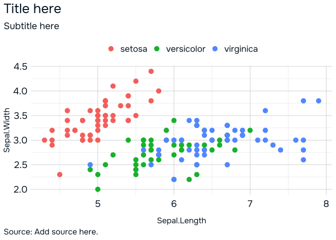
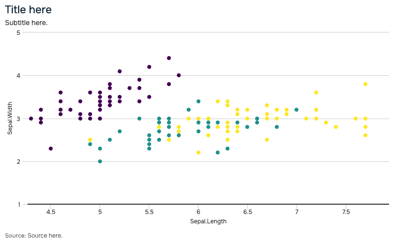
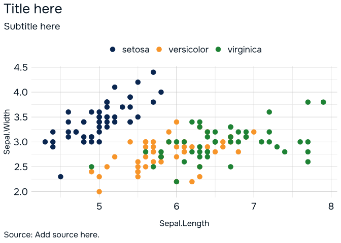

<!-- README.md is generated from README.Rmd. Please edit that file -->

# jastyle

<!-- badges: start -->
<!-- badges: end -->

The goal of jastyle is to …

## Installation

You can install the development version from
[GitHub](https://github.com/) with:

``` r
# install.packages("devtools")
devtools::install_github("januaryadvisors/jastyle")
```

## Font

The package uses [Onest](https://fonts.google.com/specimen/Onest) as its
base font. Onest is registered automatically on package load via
`sysfonts::font_add_google("Onest")` and `showtext::showtext_auto()`, so
no manual install is needed.

``` r
library(jastyle)
ja_font()
#> [1] "Onest"
```

## Use ggplot theme_ja()

``` r
library(tidyverse)
#> ── Attaching core tidyverse packages ──────────────────────── tidyverse 2.0.0 ──
#> ✔ dplyr     1.1.4     ✔ readr     2.1.5
#> ✔ forcats   1.0.0     ✔ stringr   1.5.1
#> ✔ ggplot2   3.5.2     ✔ tibble    3.2.1
#> ✔ lubridate 1.9.3     ✔ tidyr     1.3.1
#> ✔ purrr     1.2.0     
#> ── Conflicts ────────────────────────────────────────── tidyverse_conflicts() ──
#> ✖ dplyr::filter() masks stats::filter()
#> ✖ dplyr::lag()    masks stats::lag()
#> ℹ Use the conflicted package (<http://conflicted.r-lib.org/>) to force all conflicts to become errors
ggplot(iris) +
  geom_point(aes(x=Sepal.Length, y=Sepal.Width, color=Species), size=3) +
  ggtitle("Title here", subtitle = "Subtitle here") +
  labs(caption = "Source: Add source here.") +
  theme_ja() 
```



## Use highcharter ja_hc_theme()

``` r
library(highcharter)
#> Registered S3 method overwritten by 'quantmod':
#>   method            from
#>   as.zoo.data.frame zoo
highcharter::hchart(iris, "scatter", hcaes(Sepal.Length, Sepal.Width, color=Species)) %>%
  hc_title(text = "Title here") %>%
  hc_subtitle(text = "Subtitle here.") %>%
  hc_caption(text = "<strong>Source</strong>: Source here.") %>%
  hc_add_theme(ja_hc_theme())
```



## Custom ja_colors

### View colors

``` r

ja_view_colors()
```

### Apply manual color palette

``` r
ggplot(iris) +
  geom_point(aes(x=Sepal.Length, y=Sepal.Width, color=Species), size=3) +
  ggtitle("Title here", subtitle = "Subtitle here") +
  labs(caption = "Source: Add source here.") +
  scale_color_manual(
    values = c(ja_hex("blue"), ja_hex("orange"), ja_hex("green"))
  ) +
  theme_ja()
```


