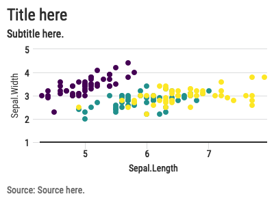

<!-- README.md is generated from README.Rmd. Please edit that file -->

# jastyle

<!-- badges: start -->
<!-- badges: end -->

The goal of jastyle is to …

## Installation

You can install the development version from
[GitHub](https://github.com/) with:

``` r
# install.packages("devtools")
devtools::install_github("januaryadvisors/jastyle")
```

## Check font

You need to have Roboto Condensed installed. Check your system to see if
you do. If not, go here and download it
[here](https://fonts.google.com/specimen/Roboto+Condensed).

``` r
library(jastyle)
ja_font()
#> [1] "Roboto Condensed"
```

## Use ggplot theme\_ja()

``` r
library(tidyverse)
#> ── Attaching packages ─────────────────────────────────────── tidyverse 1.3.0 ──
#> ✓ ggplot2 3.3.3     ✓ purrr   0.3.4
#> ✓ tibble  3.1.2     ✓ dplyr   1.0.6
#> ✓ tidyr   1.1.3     ✓ stringr 1.4.0
#> ✓ readr   1.4.0     ✓ forcats 0.5.1
#> ── Conflicts ────────────────────────────────────────── tidyverse_conflicts() ──
#> x dplyr::filter() masks stats::filter()
#> x dplyr::lag()    masks stats::lag()
ggplot(iris) +
  geom_point(aes(x=Sepal.Length, y=Sepal.Width, color=Species), size=3) +
  ggtitle("Title here", subtitle = "Subtitle here") +
  labs(caption = "Source: Add source here.") +
  theme_ja()
```


## Use highcharter ja\_hc\_theme()

``` r
library(highcharter)
#> Registered S3 method overwritten by 'quantmod':
#>   method            from
#>   as.zoo.data.frame zoo
highcharter::hchart(iris, "scatter", hcaes(Sepal.Length, Sepal.Width, color=Species)) %>% 
  hc_title(text = "Title here") %>% 
  hc_subtitle(text = "Subtitle here.") %>% 
  hc_caption(text = "<strong>Source</strong>: Source here.") %>% 
  hc_add_theme(ja_hc_theme())
```



## Custom ja\_colors

### View colors

``` r
ja_view_colors()
```

### Apply manual color palette

``` r
ggplot(iris) +
  geom_point(aes(x=Sepal.Length, y=Sepal.Width, color=Species), size=3) +
  ggtitle("Title here", subtitle = "Subtitle here") +
  labs(caption = "Source: Add source here.") +
  scale_color_manual(
    values = c(ja_hex("blue"), ja_hex("orange"), ja_hex("green"))
  ) +
  theme_ja()
```


